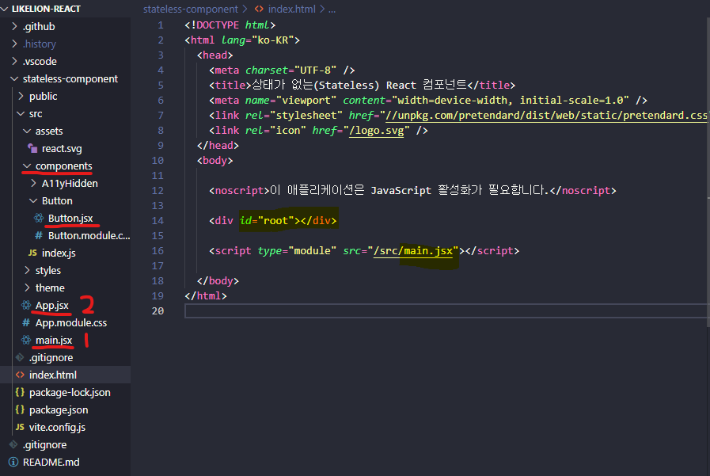
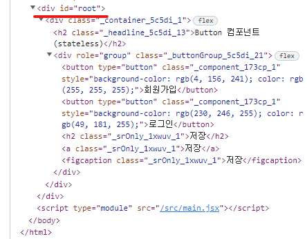

## 0222 함수 컴포넌트를 사용하여 Button 동작구현하기
---
### React 가상돔을 이용하여 만드는 예제
>### GitHub URL
>[likeLion-React](https://github.com/dydgh142/likelion-react) 
>_branch-05_

 

<U>해당 폴더에서의 파일연결은 신경쓰지않고 설명위주로 작성되었음</U>
 

  

 

  

